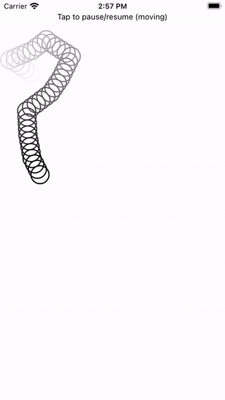

# Worm (SwiftUI)
Application for educational purposes as a part of the "Programmerare iPhone och Android" course.

Goals:
* to learn how to use GeometryReader to get screen dimensions
* to learn how to use GeometryReader to process screen rotation (once screen's rotated and the worm is out of the screen - it goes to the new screen center)
* to learn shapes and some animation withour using SpriteKit.

**Animated preview:**

